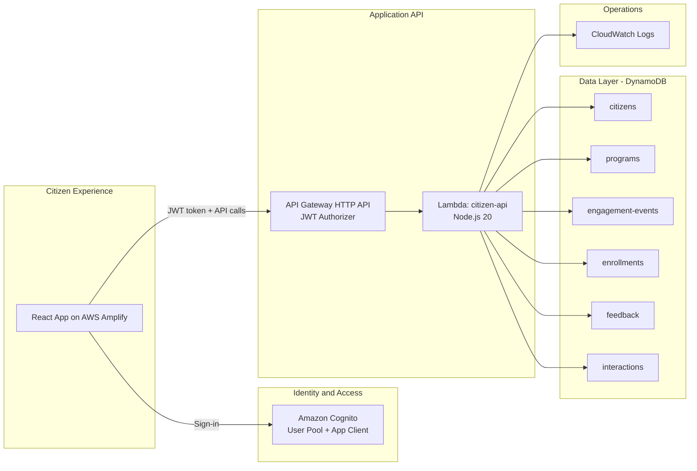
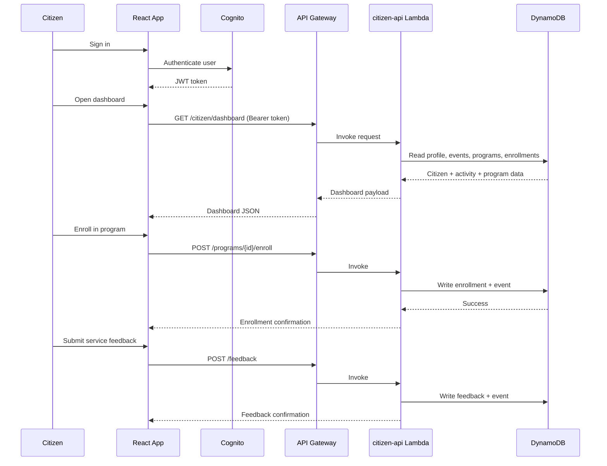

# Pawnee Smart Civic Engagement Desk Architecture

## 1. Solution Architecture (Visual)

## 2. Primary User Flow (Visual)

## 3. Backend Responsibilities by Endpoint

- `GET /health`: backend health status.
- `GET /citizen/profile`: citizen identity/profile payload.
- `GET /citizen/dashboard`: points, tier, recommendations, timeline.
- `GET /programs`: active community programs.
- `POST /programs/{program_id}/enroll`: enroll and log event.
- `GET /activity`: engagement timeline.
- `GET /interactions`: service interactions available for feedback.
- `POST /feedback`: submit rating/comment with duplicate protection.

## 4. Security and Deployment Notes

- API endpoints (except health) are protected with Cognito JWT authorizer.
- Lambda has least-privilege IAM scoped to required DynamoDB tables.
- Data uses DynamoDB server-side encryption and point-in-time recovery.
- Infrastructure is provisioned via Terraform under `infra/terraform`.
- Frontend deployment is Amplify-managed and intentionally not included in Terraform per project decision.
