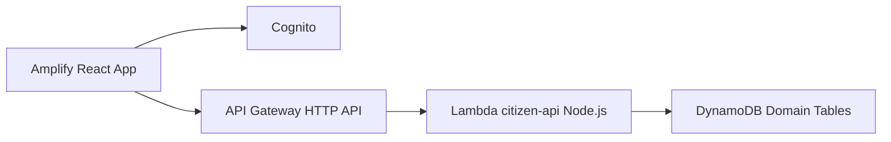

# Pawnee Smart Civic Engagement Desk
## Business Case, Audience, and Usage

Town of Pawnee

---

## Why This Product Exists

Pawnee has strong community participation, but citizen engagement data is fragmented.

Business problem:
- Agents do not have one place to view loyalty and engagement context.
- Citizens do not clearly see their progress, status, or best next actions.
- Supervisors cannot consistently connect service quality to coaching opportunities.

---

## The Opportunity

Treat civic engagement like a relationship, not a transaction.

What changes:
- Citizens get clear visibility into points, milestones, and opportunities.
- Agents get context-aware recommendations while serving residents.
- Leadership gets measurable trends on participation and service quality.

---

## Who It Is For

Primary users:
- Citizens: view status, history, recommendations, and submit service feedback.
- Service agents: support citizens with context and next-best-action prompts.
- Supervisors: monitor ratings and identify coaching opportunities.
- Administrators: manage programs, tiers, and point rules.

---

## How Citizens Use It

1. Sign in to the portal.
2. View dashboard points, tier, and timeline.
3. Enroll in recommended civic programs.
4. Participate and earn loyalty points.
5. Rate service interactions to improve city support.

Outcome: residents feel recognized and are more likely to stay engaged.

---

## How Agents and Supervisors Use It

Agent workflow:
- Open citizen profile.
- Understand loyalty status and recent activity.
- Offer tailored next steps.

Supervisor workflow:
- Track low-rating interactions.
- Review trends by team/program/location.
- Target coaching based on real data.

---

## Product Scope We Built

Citizen-facing capabilities implemented:
- Sign-in flow
- Dashboard metrics (points, tier, progress)
- Recommendations
- Program enrollment
- Activity timeline
- Feedback submission with duplicate protection

Backend capabilities implemented:
- Node.js Lambda API
- Cognito JWT-protected endpoints
- DynamoDB domain tables
- Terraform-based backend provisioning

---

## Architecture at a Glance



---

## Expected Business Impact

- Higher repeat participation in civic programs.
- Better resident satisfaction due to personalized service.
- Faster agent handling with improved context.
- Stronger coaching loop from feedback and trend visibility.

KPIs to track:
- Monthly active citizens
- Program enrollment conversion rate
- Citizen rating trend
- Recommendation adoption rate

---

## Rollout Plan

Phase 1:
- Pilot with one department plus selected community programs.
- Validate engagement and satisfaction signals.

Phase 2:
- Expand to additional programs and service centers.
- Add deeper supervisor analytics and admin tooling.

Phase 3:
- Optimize recommendation quality and operational automation.

---

## Decision Summary

Pawnee should proceed with this platform because it:
- Improves citizen experience,
- Increases community participation,
- Gives agents better tools,
- Creates measurable, actionable outcomes for leadership.

Next step: launch pilot and baseline KPIs in the first 30 days.

---

## Reveal.js Quick Start

1. Create a minimal Reveal.js page with the markdown plugin.
2. Point the markdown source to this file.
3. Present with keyboard arrows or swipe gestures on mobile.

Example section markup for a Reveal.js host page:

```html
<section data-markdown="docs/pawnee-business-case-deck-reveal.md"
         data-separator="^---$"
         data-separator-vertical="^--$"></section>
```
