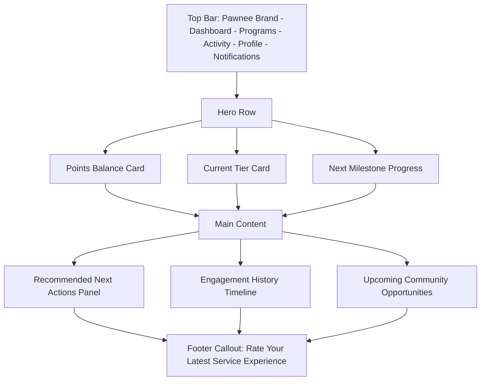
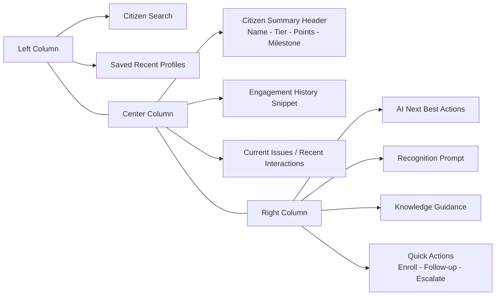
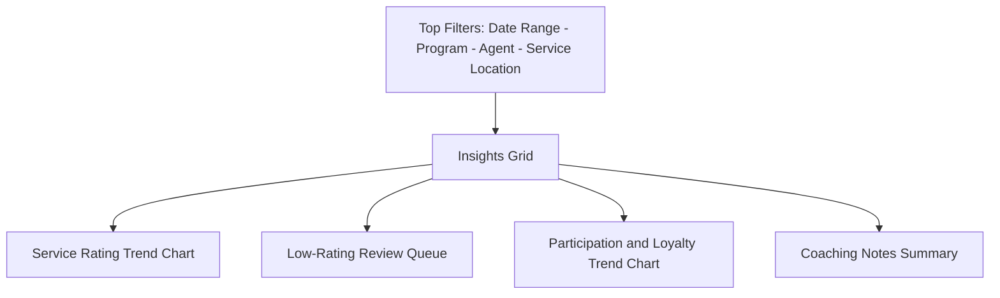
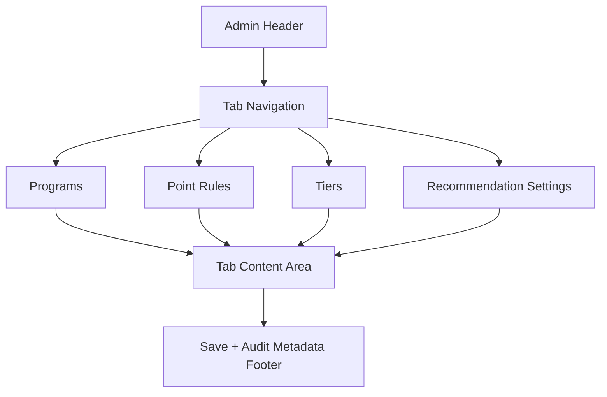
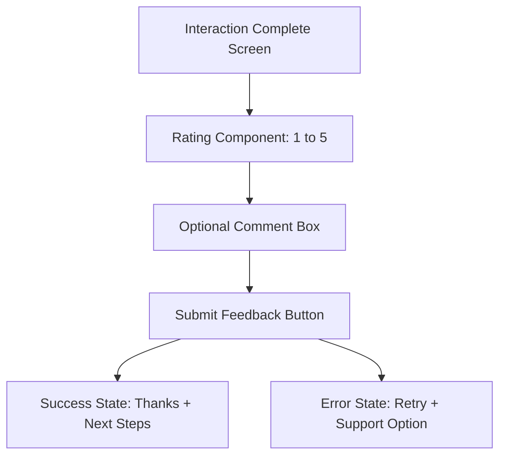

# Pawnee Smart Civic Engagement Desk Wireframe Notes

## 1. Citizen Dashboard

### Visual Wireframe (Markdown)

### Layout

Top bar:
1. Pawnee brand mark
2. Navigation: Dashboard, Programs, Activity, Profile
3. Notification icon

Hero summary row:
1. Points balance card
2. Current tier card
3. Next milestone progress card

Main content:
1. Recommended next actions panel
2. Engagement history timeline
3. Upcoming community opportunities panel

Footer callout:
1. Rate your latest service experience

### Notes

1. The dashboard should feel civic and friendly, not gamified in a trivial way.
2. Rewards language should emphasize participation, recognition, and impact.

## 2. Agent Console

### Visual Wireframe (Markdown)

### Layout

Left column:
1. Citizen search
2. Saved recent profiles

Center column:
1. Citizen summary header with name, status tier, points, and recent milestone
2. Engagement history snippet
3. Current issues / recent interactions

Right column:
1. AI next best actions
2. Recognition prompt
3. Knowledge guidance
4. Quick actions: enroll in program, create follow-up, escalate

### Notes

1. The page should optimize for fast reading during active service interactions.
2. Recommendations and knowledge guidance should be distinct visually.

## 3. Supervisor Insights View

### Visual Wireframe (Markdown)

### Layout

Top filters:
1. Date range
2. Program
3. Agent
4. Service location

Main panels:
1. Service rating trend chart
2. Low-rating review queue
3. Participation and loyalty trend chart
4. Coaching notes summary

### Notes

1. Supervisors should be able to move from aggregate trends into actionable review items quickly.
2. Flagged issues should remain visible until reviewed.

## 4. Admin Configuration View

### Visual Wireframe (Markdown)

### Layout

Tabs:
1. Programs
2. Point Rules
3. Tiers
4. Recommendation Settings

### Notes

1. Admin tooling can be utilitarian; speed and clarity matter more than polish in MVP.
2. Audit metadata should be visible for key changes.

## 5. Feedback Submission State

### Visual Wireframe (Markdown)

### Layout

1. Post-interaction context header.
2. Star or numeric rating selector.
3. Optional free-text comment input.
4. Submit action with loading state.
5. Confirmation and follow-up state after successful submission.

### Notes

1. Feedback capture should be simple and quick for mobile and desktop.
2. Prevent duplicate submissions for the same interaction while keeping the user informed.

## Demo Wireframe Order

1. Citizen Dashboard
2. Agent Console
3. Feedback submission state
4. Supervisor Insights View